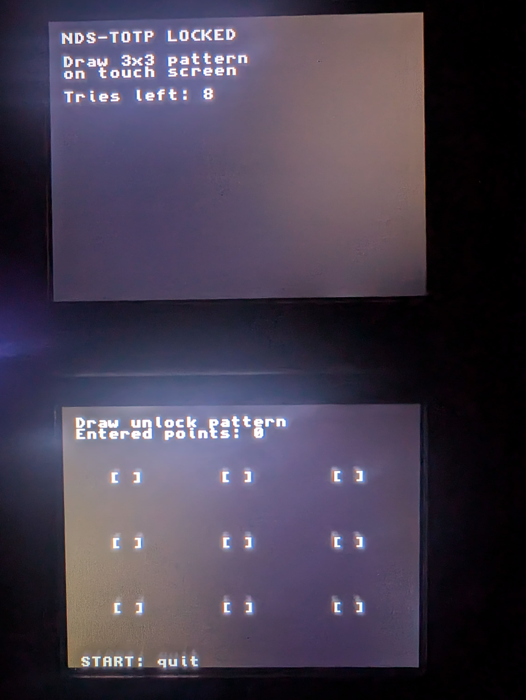
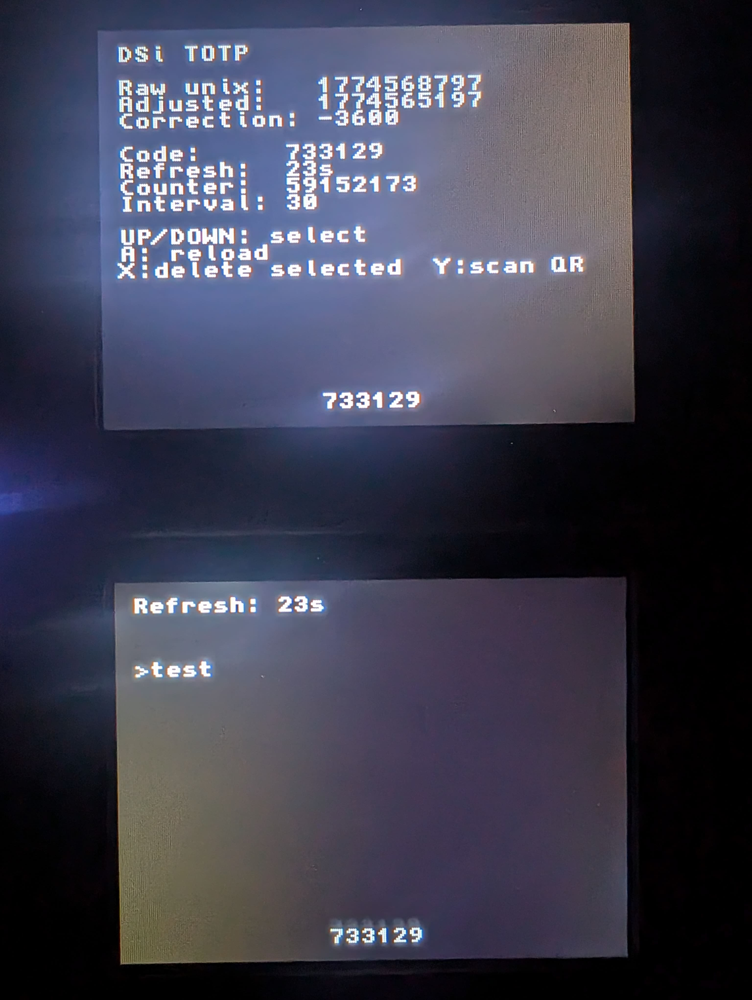

# NDS-TOTP

A TOTP authenticator for Nintendo DS/DSi with encrypted token storage and touchscreen 3x3 pattern unlock. Ported from [Simple C TOTP](https://github.com/msantos/totp.c).

## Version

- **V2.1** (current): modularized codebase + normalized library layout + stable on-device QR import.

## Features

- RFC 6238-compliant TOTP (6 digits).
- HMAC-SHA1 cryptography.
- Encrypted token vault in `/totp/tokens.bin`.
- 3x3 pattern lock screen on touchscreen before token display.
- Dual-screen UI:
  - Top: diagnostics and active token info.
  - Bottom: service list (5 visible) and large current code.
- `START` quick exit.
- QR import directly on DSi camera (`Y`).
- Safe delete flow in-app:
  - `X` arms deletion
  - `Y` confirms deletion
  - pressing `X` again cancels deletion

## Documentation

- Functional and technical flow guide: [docs/HOW_IT_WORKS.md](docs/HOW_IT_WORKS.md)

## Screenshots

### Unlock screen



### Main TOTP screen



## Requirements

- Nintendo DS / DSi with homebrew loader.
- SD card.
- devkitARM + libnds for DS build.
- host `gcc` for the token packer tool.

## Build

```bash
make
make packer
```

Outputs:

- `nds-totp.nds` (DS application)
- `tools/totp-pack` (host utility)

## Create encrypted token file

Commands:

```bash
tools/totp-pack add  /path/to/tokens.bin <pattern> <label> <base32_secret> [interval] [t0]
tools/totp-pack set  /path/to/tokens.bin <pattern> <label> <base32_secret> [interval] [t0]
tools/totp-pack del  /path/to/tokens.bin <pattern> <label> [--yes]
tools/totp-pack rename /path/to/tokens.bin <pattern> <old_label> <new_label>
tools/totp-pack list /path/to/tokens.bin <pattern>
tools/totp-pack migrate /path/to/tokens.bin <pattern> <new_pin>
tools/totp-pack rekey /path/to/tokens.bin <old_pattern> [new_pattern] [--pin <old_pin>] [--new-pin <new_pin>]
```

PIN requirement (mandatory):

```bash
tools/totp-pack --pin <4-8 digits> add /path/to/tokens.bin <pattern> <label> <base32_secret> [interval] [t0]
tools/totp-pack --pin <4-8 digits> list /path/to/tokens.bin <pattern>
tools/totp-pack --pin <4-8 digits> set  /path/to/tokens.bin <pattern> <label> <base32_secret> [interval] [t0]
tools/totp-pack --pin <4-8 digits> del  /path/to/tokens.bin <pattern> <label> [--yes]
tools/totp-pack --pin <4-8 digits> rename /path/to/tokens.bin <pattern> <old_label> <new_label>
tools/totp-pack --pin <4-8 digits> rekey /path/to/tokens.bin <old_pattern> <new_pattern>
tools/totp-pack --pin <4-8 digits> --new-pin <4-8 digits> rekey /path/to/tokens.bin <old_pattern>
tools/totp-pack --pin <4-8 digits> --new-pin <4-8 digits> rekey /path/to/tokens.bin <old_pattern> <new_pattern>
tools/totp-pack migrate /path/to/tokens.bin <pattern> <new_pin>
```

Rekey notes:

- `rekey` rotates the unlock secret(s) without changing stored token entries
- on v1 vaults, `rekey` requires `--new-pin` to upgrade to v2 (pattern+PIN)
- on v2 vaults, `--new-pin` rotates PIN; `new_pattern` is optional for PIN-only rotation
- for `add/set/del/rename`, passing `--pin` on a v1 vault automatically upgrades it to v2

App policy:

- the DS app now requires a v2 vault with both pattern and PIN
- v1 vaults are refused by the app and must be migrated first (`migrate`)

Pattern rules:

- digits `1..9`
- no duplicates
- minimum length: 5
- obvious sequences/straight lines are rejected by default in `totp-pack`
- use `--allow-weak-pattern` only if you really need legacy compatibility

PIN rules:

- digits only (`0..9`)
- length: `4` to `8`
- weak PINs (e.g. repeated or monotonic sequences) are rejected by default
- PIN must differ from the pattern string
- use `--allow-weak-pin` only for legacy/temporary use

Mapping:

```text
1 2 3
4 5 6
7 8 9
```

Example:

```bash
tools/totp-pack --pin 120938 add ./tokens.bin 14789 GitHub JBSWY3DPEBLW64TMMQ====== 30 0
tools/totp-pack --pin 120938 add ./tokens.bin 14789 Email  OBWGC2LOFVZXG53POJZXG53POJZXG53P 30 0
tools/totp-pack --pin 120938 rename ./tokens.bin 14789 Email WorkMail
tools/totp-pack --pin 120938 set ./tokens.bin 14789 WorkMail JBSWY3DPEHPK3PXP 30 0
tools/totp-pack --pin 120938 del ./tokens.bin 14789 GitHub
tools/totp-pack --pin 120938 list ./tokens.bin 14789
tools/totp-pack --pin 120938 --new-pin 490271 rekey ./tokens.bin 14789
```

Important:

- One `tokens.bin` uses one unlock pattern for all entries.
- Mixing different patterns in the same file is rejected.
- `del` asks for confirmation (`Y` or `yes`). Use `--yes` to skip prompt.
- Vault format supports:
  - v1: pattern-only unlock
  - v2: pattern + PIN unlock

## Install on SD

1. Copy `nds-totp.nds` to your DS launcher location.
2. Copy `tokens.bin` to `/totp/tokens.bin` on SD.
3. Launch app and draw the same pattern to unlock.

## Controls

- Touchscreen: Draw unlock pattern
- UP / DOWN: Navigate service list
- A: Reload encrypted tokens
- L / R: Change timezone UTC by -/+ 1 hour (saved to settings)
- SELECT: Toggle daylight saving time (DST) on/off
- X: Arm deletion for selected entry
- Y: Confirm deletion (after X), otherwise scan `otpauth://...` from DSi camera
- START: Exit app

## Notes

- This V2.1 stores encrypted entries in `tokens.bin`.
- Tokens are decrypted in RAM only after successful unlock.
- Keep your pattern secret; anyone with SD + pattern can decrypt tokens.
- QR scan (`Y`) requires DSi mode and uses the built-in camera.
- Runtime settings are saved in `/totp/settings.cfg` (or `sd:/totp/settings.cfg`, `fat:/totp/settings.cfg`).
- Settings currently include `utc_offset_minutes` and `dst_enabled`.

## Credits

- Original TOTP C project: Michael Santos — [msantos/totp.c](https://github.com/msantos/totp.c)
- QR decoding library: Daniel Beer — [dlbeer/quirc](https://github.com/dlbeer/quirc)
- DSi camera integration library: Epicpkmn11 — [Epicpkmn11/dsi-camera](https://github.com/Epicpkmn11/dsi-camera)
- SHA-1 / HMAC implementation used in this project is based on code credited in source headers to Michael Santos and David M. Syzdek.

## License

This project is licensed under **GNU General Public License v3.0 or later**.

- Full text: [LICENSE](LICENSE)
- Third-party notices and attribution: [THIRD_PARTY_NOTICES.md](THIRD_PARTY_NOTICES.md)

## Troubleshooting

- No tokens: verify `/totp/tokens.bin` exists.
- Unlock fails: pattern must match exactly the one used with `totp-pack`.
- Wrong OTP time: use `L/R` for timezone and `SELECT` for DST (saved automatically, no rebuild needed).

## Changelog (V2 -> V2.1)

- Refactored the monolithic code into modules with headers:
  - `main.c`
  - `gui.c` + `gui.h`
  - `crypto.c` + `crypto.h`
  - `totp.c` + `totp.h`
  - `camera_scan.c` + `camera_scan.h`
  - `qr.c` + `qr.h`
  - `app.h` (shared types/constants)
- Moved vendored libraries out of `third_party/` into top-level normalized folders:
  - `dsi_camera/`
  - `quirc/`
- Updated build integration in `Makefile` for the new source/include paths.
- Preserved the in-app UX features introduced in V2 (safe delete flow, status messages, QR import controls).
- Kept the QR decode stability fix (stack-heavy decode workspace moved out of small runtime stack in quirc).

### Migration structure (old -> new)

- `totp.c` (monolithic) -> `main.c` + `gui.c` + `crypto.c` + `camera_scan.c` + `qr.c` + `totp.c`
- `third_party/dsi-camera/...` -> `dsi_camera/...`
- `third_party/quirc/...` -> `quirc/...`
- Shared app globals/constants -> `app.h`

## Changelog (V1 -> V2)

- Added encrypted vault workflow centered on `/totp/tokens.bin`.
- Added touchscreen 3x3 pattern unlock before token access.
- Added in-app QR import from DSi camera (`Y`).
- Added safer in-app deletion flow:
  - `X` arms deletion
  - `Y` confirms deletion
  - second `X` cancels deletion
- Added host management improvements in `totp-pack` (safer delete flow and clearer commands).
- Updated dual-screen UX and status messages.
- Integrated and credited third-party components for QR and DSi camera support.
