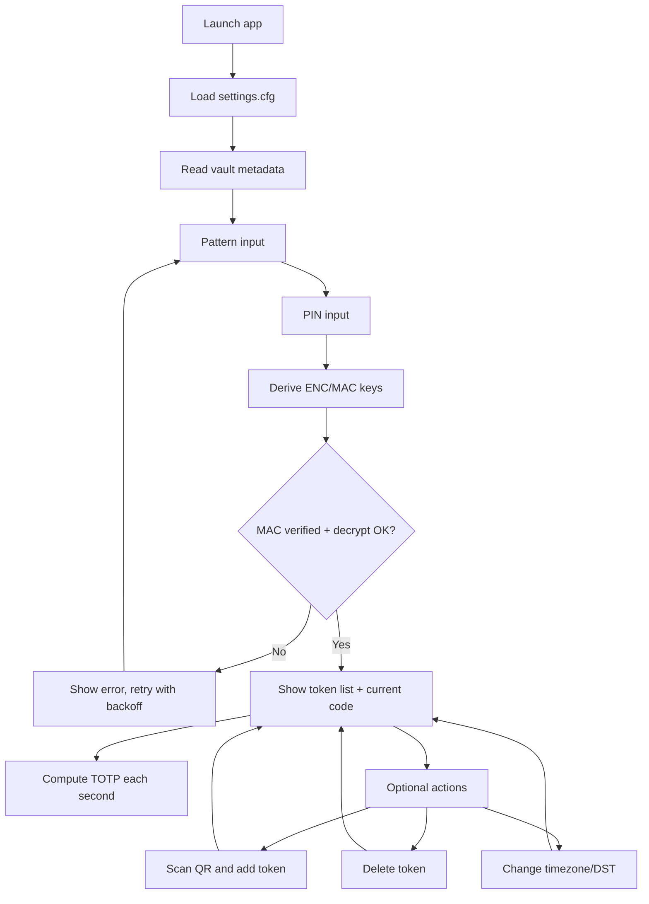
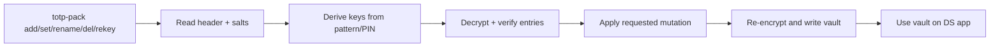

# How NDS-TOTP Works

This document explains how the program works for both users and contributors.

## 1. High-Level Overview

NDS-TOTP has two parts:

- DS app (`nds-totp.nds`): unlocks an encrypted vault, displays TOTP codes, scans QR codes, and manages tokens on-device.
- Host tool (`tools/totp-pack`): creates and edits the encrypted vault from a PC.

Core idea:

- Secrets are stored encrypted in `tokens.bin`.
- The app requires both pattern and PIN to derive session keys.
- After unlock, tokens are decrypted in RAM and displayed.

## 2. User Runtime Flow

## 3. Data and Security Model

The vault file contains:

- Header: magic, version, salts, entry count
- Entries: encrypted payload (label + secret), metadata, authentication tag

Security properties:

- Key derivation is based on pattern + PIN (v2 vault)
- Tag checks are constant-time
- Sensitive buffers are wiped where practical
- App refuses legacy v1 vaults by policy

## 4. Vault Lifecycle Flow

## 5. Time Configuration (No Rebuild Needed)

Runtime settings are stored in `settings.cfg`.

Current keys:

- `utc_offset_minutes`
- `dst_enabled`
- legacy compatibility key: `time_offset_seconds`

In app controls:

- `L` / `R`: change UTC offset by 1 hour
- `SELECT`: toggle DST on/off

The app computes an internal correction from these values and applies it when generating displayed codes.

## 6. QR Import Flow

- Camera frame is captured
- Frame is converted to grayscale
- `quirc` detects and decodes QR payload
- URI parser validates `otpauth://totp/...`
- Parsed token is appended to encrypted vault

## 7. Main Modules

- `main.c`: app loop, input actions, orchestration
- `gui.c`: unlock and dual-screen rendering
- `crypto.c`: vault I/O, key derivation, encrypt/decrypt, tags
- `config.c`: persistent settings load/save
- `qr.c`: otpauth URI parsing and validation
- `camera_scan.c`: DSi camera capture + QR decoding
- `totp.c`: TOTP computation primitives
- `tools/totp_pack.c`: host-side vault management

## 8. Typical Contributor Workflow

1. Use `tools/totp-pack` to create a test `tokens.bin`.
2. Copy vault to `/totp/tokens.bin` on SD.
3. Run app and unlock with pattern+PIN.
4. Test actions (list refresh, QR import, delete, timezone/DST).
5. Rebuild host tool with `make packer`; rebuild app with `make`.

## 9. Troubleshooting Pointers

- Unlock fails: pattern/PIN mismatch, or corrupted vault
- Wrong time codes: adjust UTC offset or DST in app
- QR import fails: ensure DSi mode and valid `otpauth://` payload
- Legacy vault error: migrate to v2 with `totp-pack`
